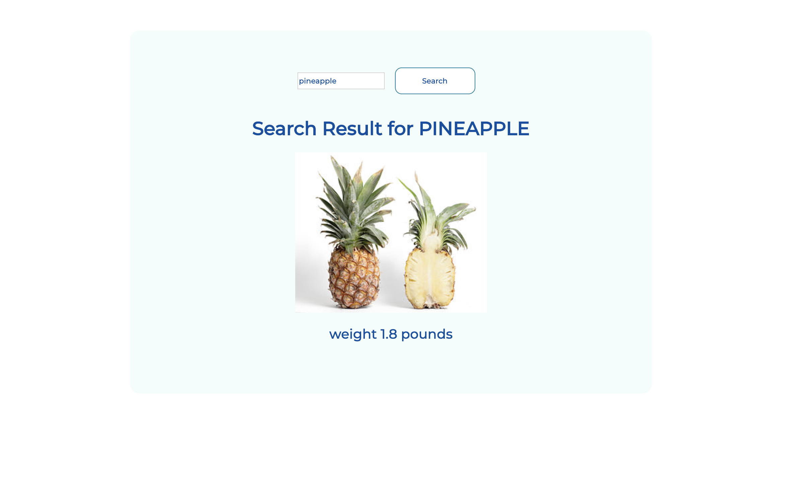

**UI should display:**

Button **Search** clicked:

Fruit Search App built with React and Express.

Clone Repo, Enter and Run following commands

### `npm install`

To start Server:

### `npm start`

To start client:

### `cd client`
### `npm install`
### `npm start` 

Deployed the App in Heroku: [Fruit Search App for Beautycounter](https://beautycounter.herokuapp.com/)

This is a minimal demo of using Create React App to bootstrap a React project, connect the React app to an Express backend, and deploy the whole thing to Heroku.
